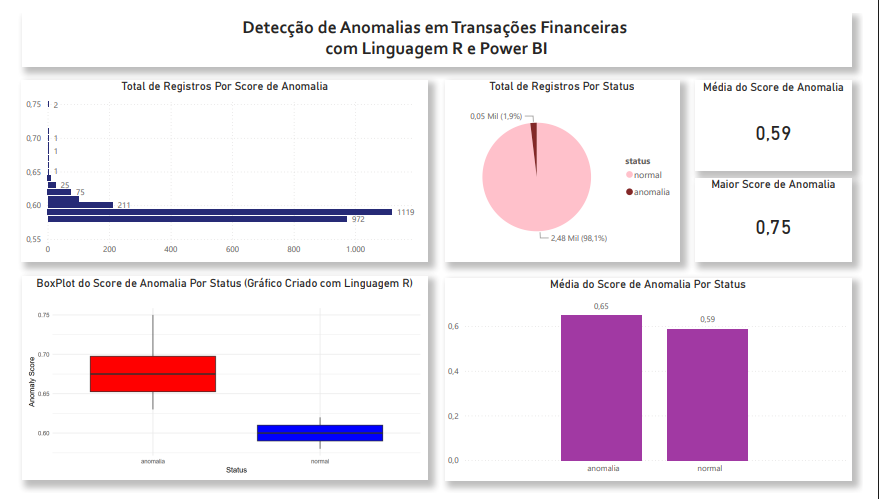

# Detecção de Anomalias em Transações Financeiras

## Descrição
Este projeto aborda a identificação de comportamentos atípicos em transações financeiras, simulando um cenário de prevenção a fraudes. A solução utiliza o algoritmo de Machine Learning não supervisionado Isolation Forest, implementado em linguagem R, para isolar registros que divergem do padrão histórico de movimentações.

A integração entre a modelagem estatística em R e a visualização no Power BI permite que analistas financeiros monitorem o anomaly score de cada transação, facilitando a identificação rápida de atividades suspeitas e a mitigação de riscos operacionais.

## Pipeline
1. Extração e Configuração de Ambiente
2. Implementação e Treinamento do Modelos 
3. Escalonamento e Definição de Threshold 
4. Validação com Novos Dados 
5. Exportação e Integração
6. Visualização Analítica e Dashboards

## Objetivos Técnicos
* **Detecção Não Supervisionada:** Aplicação do algoritmo Isolation Forest para identificar anomalias sem a necessidade de dados previamente rotulados como fraude.
* **Análise de Densidade:** Avaliação da distribuição dos scores para definição estatística do limiar (threshold) de anomalia.
* **Engenharia de Features:** Criação de colunas de status e arredondamento de métricas para consumo em dashboards.
* **Integração R-BI:** Execução de scripts R diretamente no Power BI para geração de visualizações estatísticas avançadas, como o Box Plot.

## Tecnologias e Ferramentas
* **Linguagem R:** Motor principal para processamento e modelagem estatística.
* **Solitude:** Biblioteca específica para implementação do algoritmo Isolation Forest.
* **Tidyverse & Ggplot2:** Manipulação de dados e visualização científica.
* **Power BI Desktop:** Camada de apresentação e interface interativa.

## Desenvolvimento da Solução

### 1. Extração e Configuração de Ambiente 
```r
# Instala os pacotes
install.packages("tidyverse")
install.packages("dplyr")
install.packages("solitude")
install.packages("ggplot2")
install.packages("readr")

# Carrega os pacotes nesta sessão R
library(tidyverse)
library(dplyr)
library(solitude)
library(ggplot2)
library(readr)

# Carrega os dados históricos
dados_historicos_dsa <- read_csv("dados_historicos.csv")

# Visualiza os dados históricos
View(dados_historicos_dsa)
```
### 2. Implementação e Treinamento do Modelo
```r
# Consulta Documentação do Algoritmo
?isolationForest 

# Cria o modelo de Machine Learning com algoritmo isolationForest
modelo_ml_dsa = isolationForest$new() 

# Treina o modelo
modelo_ml_dsa$fit(dados_historicos_dsa)

# Faz as previsões com o modelo usando os dados históricos
previsoes_historico = dados_historicos_dsa %>%
  modelo_ml_dsa$predict() %>%
  arrange(desc(anomaly_score))

# Faz as previsões com o modelo usando os dados históricos
previsoes_historico = dados_historicos_dsa %>%
  modelo_ml_dsa$predict() %>%
  arrange(desc(anomaly_score))

# Visualiza as previsões
View(previsoes_historico)
```
### 3. Escalonamento e Definição de Threshold
```r
# Density Plot 
plot(density(previsoes_historico$anomaly_score))

# Quanto maior o anomaly score maior a chance do registro ser uma anomalia

# Define como regra que anomaly score acima de 0.62 é uma anomalia
indices_historico = previsoes_historico[which(previsoes_historico$anomaly_score > 0.62)]

# Faz o filtro
anomalias_historico = dados_historicos_dsa[indices_historico$id, ]
normais_historico = dados_historicos_dsa[-indices_historico$id, ]

# Gráfico
colors()
ggplot() + 
  geom_point(data = normais_historico, 
             mapping = aes(transacao1,transacao2), 
             col = "skyblue3", 
             alpha = 0.5) + 
  geom_point(data = anomalias_historico,
             mapping = aes(transacao1,transacao2), 
             col = "red2", 
             alpha = 0.8)
```
### 4. Validação com Novos Dados
```r
# Carregando e visualizando novos dados
novos_dados_dsa <- read.csv("novos_dados.csv")
View(novos_dados_dsa)

# Previsões com o modelo treinado
previsoes_novos_dados = modelo_ml_dsa$predict(novos_dados_dsa)

# Se o anomaly score é maior que 0.62 consideramos como anomalia
indices_novos_dados = previsoes_novos_dados[which(previsoes_novos_dados$anomaly_score > 0.62)]

# Filtro
anomalias_novos_dados = novos_dados_dsa[indices_novos_dados$id, ]
normais_novos_dados = novos_dados_dsa[-indices_novos_dados$id, ]

# Gráfico
ggplot() + 
  geom_point(data = normais_novos_dados, 
             mapping = aes(transacao1,transacao2), 
             col = "turquoise3", 
             alpha = 0.5) + 
  geom_point(data = anomalias_novos_dados, 
             mapping = aes(transacao1,transacao2), 
             col = "tomato3", 
             alpha = 0.8)

# Visualizando previsões
View(previsoes_novos_dados)

# Arredondando a coluna 'anomaly_score' para 2 casas decimais
previsoes_novos_dados <- previsoes_novos_dados %>%
  mutate(anomaly_score = round(anomaly_score, 2))
```
### 5. Exportação e Integração
```r
# Criando uma nova coluna (status) com base na condição score de anomalias
previsoes_novos_dados <- previsoes_novos_dados %>%
  mutate(status = ifelse(anomaly_score > 0.62, "anomalia", "normal"))
  
# Criando o box plot
ggplot(previsoes_novos_dados, aes(x = status, y = anomaly_score, fill = status)) +
  geom_boxplot() +
  labs(title = "Box Plot de Anomalias e Normais",
       x = "Status",
       y = "Anomaly Score") +
  theme_minimal() +
  scale_fill_manual(values = c("anomalia" = "red", "normal" = "blue")) +
  theme(legend.position = "none")
```
### 5. Exportação e Integração
```r
# Salvando em disco
write.csv(previsoes_novos_dados, "previsoes_novos_dados.csv")
```
### 6. Visualização Analítica e Dashboards
```r
library(ggplot2)

# Criando o box plot
ggplot(dataset, aes(x = status, y = anomaly_score, fill = status)) +
  geom_boxplot() +
  labs(title = "",
       x = "Status",
       y = "Anomaly Score") +
  theme_minimal() +
  scale_fill_manual(values = c("anomalia" = "red", "normal" = "blue")) +
  theme(legend.position = "none")
```

## **Dashboard Final**


Projeto desenvolvido como parte do programa de formação em Business Intelligence e Data Science da Data Science Academy.


